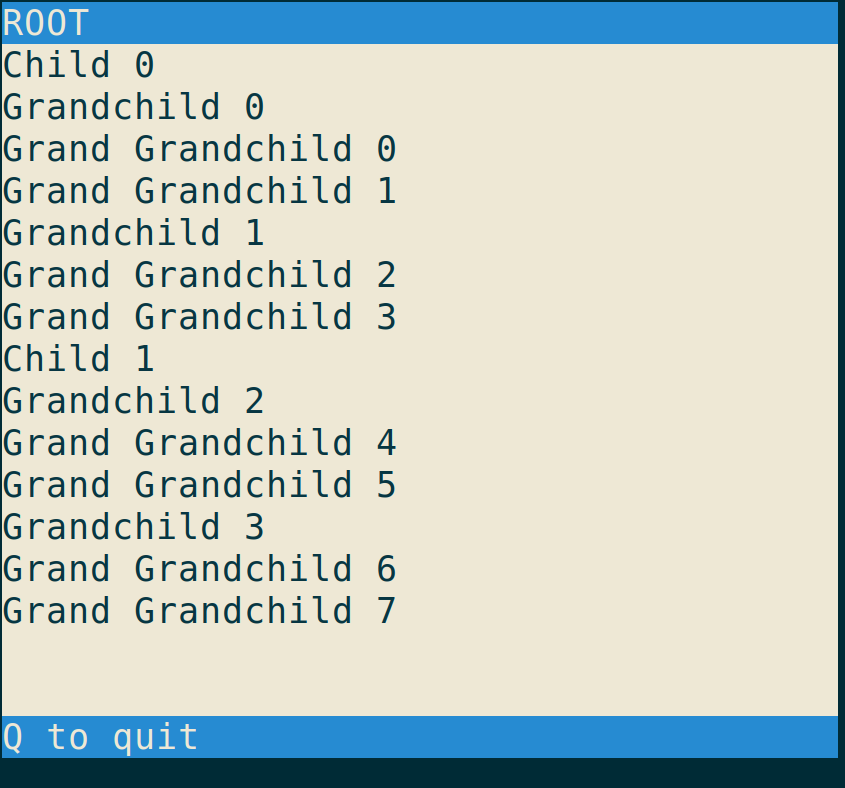
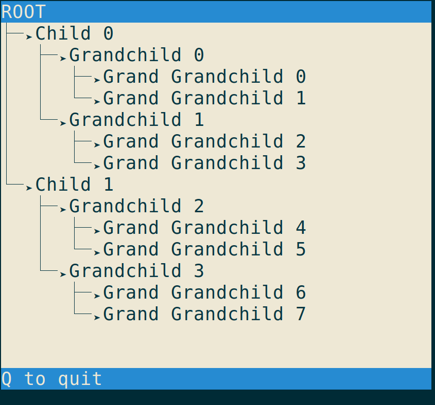
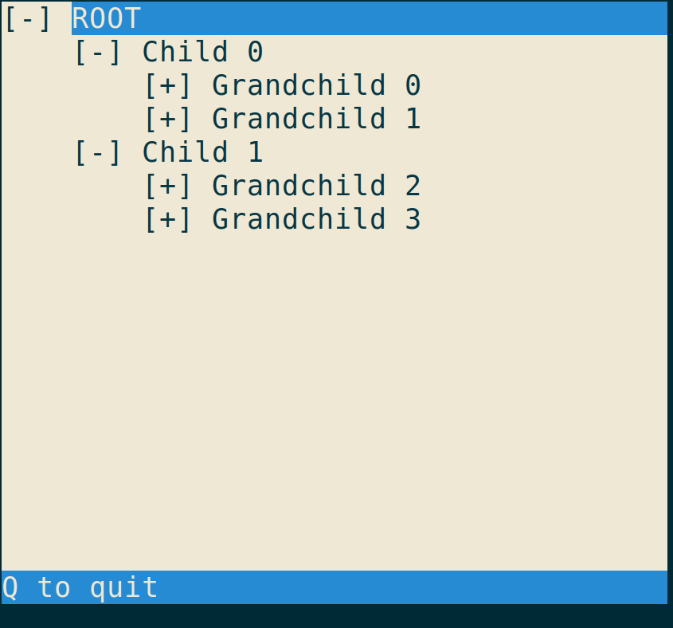
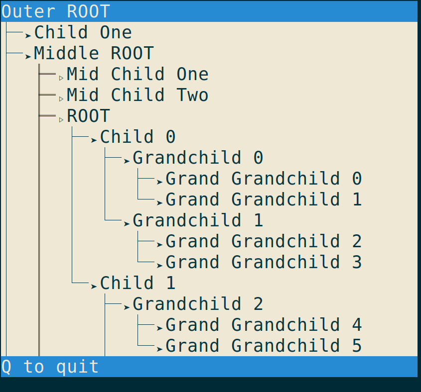

Urwid Tree Container API
========================
[![Docs Build][rtfd-img]][rtfd]

This is a Widget Container API for the [urwid](http://urwid.org/) toolkit.
It uses a MVC approach and allows to build trees of widgets.
Its design goals are

* clear separation classes that define, decorate and display trees of widgets
* representation of trees by local operations on node positions
* easy to use default implementation for simple trees
* Collapses are considered decoration

See the `docs/` subdirectory for autogenetated API docs.

### Examples

[rtfd-img]: https://readthedocs.org/projects/urwidtrees/badge/
[rtfd]: https://urwidtrees.readthedocs.org/en/latest/
